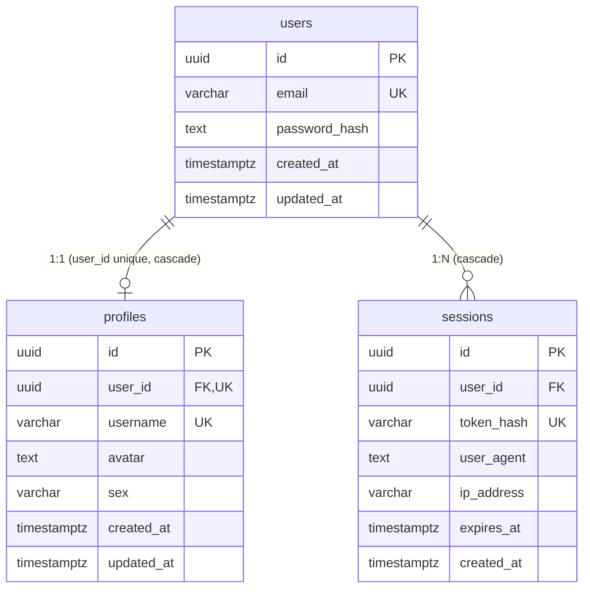

# Database Schema & ER Diagram

ER diagram of the current Memoro database (PostgreSQL / Drizzle ORM).

## ER Diagram

## Entities & Relationships

### `users` (`apps/server/src/db/schema/users.ts`)

Primary entity for user authentication and account management.

- `id` (UUID): Primary key (`defaultRandom()`).
- `email` (VARCHAR): Unique email address (`AUTH_CONSTRAINTS.EMAIL_MAX_LENGTH`).
- `password_hash` (TEXT): Password hash (scrypt via `node:crypto`).
- `created_at` / `updated_at` (TIMESTAMPTZ): Creation and update timestamps.

### `profiles` (`apps/server/src/db/schema/profiles.ts`)

User profile details (**1:1** relationship with `users`).

- `id` (UUID): Primary key.
- `user_id` (UUID): Foreign key referencing `users.id` with `UNIQUE` constraint and `onDelete: cascade`.
- `username` (VARCHAR, NULLABLE): Unique username (`PROFILE_CONSTRAINTS.USERNAME_MAX_LENGTH`).
- `avatar` (TEXT, NULLABLE): Avatar URL or storage reference.
- `sex` (VARCHAR, NULLABLE): User biological sex (`PROFILE_CONSTRAINTS.SEX_MAX_LENGTH`).
- `created_at` / `updated_at` (TIMESTAMPTZ): Creation and update timestamps.

### `sessions` (`apps/server/src/db/schema/sessions.ts`)

Active user sessions (**1:N** relationship with `users`).

- `id` (UUID): Primary key.
- `user_id` (UUID): Foreign key referencing `users.id` with `onDelete: cascade`.
- `token_hash` (VARCHAR): Unique session token hash (`AUTH_CONSTRAINTS.TOKEN_HASH_LENGTH`).
- `user_agent` (TEXT, NULLABLE): Client user-agent string.
- `ip_address` (VARCHAR, NULLABLE): Client IP address.
- `expires_at` (TIMESTAMPTZ): Session expiration timestamp.
- `created_at` (TIMESTAMPTZ): Creation timestamp.
