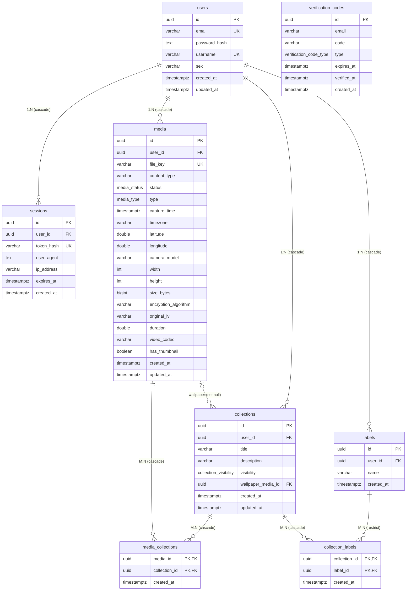

# Database Schema & ER Diagram

ER diagram of the current Memoro database (PostgreSQL / Drizzle ORM).

Schema definitions: `apps/server/src/db/schema/*.ts`. Migrations: `apps/server/src/db/migrations/`.

## ER Diagram

```mermaid
erDiagram
    users ||--o{ sessions : "1:N (cascade)"
    users ||--o{ media : "1:N (cascade)"
    users ||--o{ collections : "1:N (cascade)"
    users ||--o{ labels : "1:N (cascade)"
    media ||--o{ media_collections : "M:N (cascade)"
    collections ||--o{ media_collections : "M:N (cascade)"
    collections ||--o{ collection_labels : "M:N (cascade)"
    labels ||--o{ collection_labels : "M:N (restrict)"
    media |o--o{ collections : "wallpaper (set null)"

    users {
        uuid id PK
        varchar email UK
        text password_hash
        varchar username UK
        varchar sex
        timestamptz created_at
        timestamptz updated_at
    }

    sessions {
        uuid id PK
        uuid user_id FK
        varchar token_hash UK
        text user_agent
        varchar ip_address
        timestamptz expires_at
        timestamptz created_at
    }

    verification_codes {
        uuid id PK
        varchar email
        varchar code
        verification_code_type type
        timestamptz expires_at
        timestamptz verified_at
        timestamptz created_at
    }

    media {
        uuid id PK
        uuid user_id FK
        varchar file_key UK
        varchar content_type
        media_status status
        media_type type
        timestamptz capture_time
        varchar timezone
        double latitude
        double longitude
        varchar camera_model
        int width
        int height
        bigint size_bytes
        varchar encryption_algorithm
        varchar original_iv
        double duration
        varchar video_codec
        boolean has_thumbnail
        timestamptz created_at
        timestamptz updated_at
    }

    collections {
        uuid id PK
        uuid user_id FK
        varchar title
        varchar description
        collection_visibility visibility
        uuid wallpaper_media_id FK
        timestamptz created_at
        timestamptz updated_at
    }

    media_collections {
        uuid media_id PK,FK
        uuid collection_id PK,FK
        timestamptz created_at
    }

    labels {
        uuid id PK
        uuid user_id FK
        varchar name
        timestamptz created_at
    }

    collection_labels {
        uuid collection_id PK,FK
        uuid label_id PK,FK
        timestamptz created_at
    }
```

## Enums

Postgres enum values are generated from `const ... as const` dictionaries in `@memoro/shared` via `pgEnumValues` (`apps/server/src/db/pg-enum-values.ts`).

| Postgres enum            | Source dictionary            | Values                           |
| ------------------------ | ---------------------------- | -------------------------------- |
| `media_status`           | `MediaStatus`                | `pending`, `ready`, `failed`     |
| `media_type`             | `MediaType`                  | `image`, `video`                 |
| `collection_visibility`  | `CollectionVisibilityStatus` | `public`, `private`              |
| `verification_code_type` | `VerificationCodeType`       | `registration`, `password_reset` |

`users.sex` is a plain `varchar` restricted to `UserSex` (`male`, `female`, `other`) at the type level only (Drizzle `enum` option), not by a database constraint.

## Entities & Relationships

### `users` (`users.ts`)

Account and profile data in one row. All user-owned content (sessions, media, collections, labels) references `users.id`.

- `id` (UUID): Primary key (`defaultRandom()`).
- `email` (VARCHAR): Unique email address (`AUTH_CONSTRAINTS.EMAIL_MAX_LENGTH`).
- `password_hash` (TEXT): Password hash (scrypt via `node:crypto`, `salt:key` hex).
- `username` (VARCHAR, NULLABLE): Unique (`USER_CONSTRAINTS.USERNAME_MAX_LENGTH`).
- `sex` (VARCHAR, NULLABLE): `UserSex` value (`USER_CONSTRAINTS.SEX_MAX_LENGTH`).
- `created_at` / `updated_at` (TIMESTAMPTZ).

### `sessions` (`sessions.ts`)

Active login sessions (**1:N** with `users`). The raw token lives only in the signed `sid` cookie; the database stores its SHA-256 hash.

- `id` (UUID): Primary key.
- `user_id` (UUID): FK → `users.id`, `ON DELETE CASCADE`.
- `token_hash` (VARCHAR): Unique token hash (`AUTH_CONSTRAINTS.TOKEN_HASH_LENGTH`).
- `user_agent` (TEXT, NULLABLE).
- `ip_address` (VARCHAR, NULLABLE): (`AUTH_CONSTRAINTS.IP_ADDRESS_MAX_LENGTH`).
- `expires_at` (TIMESTAMPTZ).
- `created_at` (TIMESTAMPTZ).

### `verification_codes` (`verification-codes.ts`)

Email verification codes for registration and password reset. Not linked to `users` by FK: a registration code exists before the user does.

- `id` (UUID): Primary key.
- `email` (VARCHAR): Target email (`AUTH_CONSTRAINTS.EMAIL_MAX_LENGTH`).
- `code` (VARCHAR): Numeric code (`AUTH_CONSTRAINTS.VERIFICATION_CODE_LENGTH`).
- `type` (`verification_code_type`).
- `expires_at` (TIMESTAMPTZ): `created_at + AUTH_CONSTRAINTS.VERIFICATION_CODE_TTL_MS`.
- `verified_at` (TIMESTAMPTZ, NULLABLE): Set after a successful `verify-code`; a verified, non-expired code authorizes `register` / `reset-password`, after which all codes of that email and type are deleted.
- `created_at` (TIMESTAMPTZ).

### `media` (`media.ts`)

Uploaded photo or video (**1:N** with `users`). The file itself lives in R2 under `file_key`; the row stores metadata extracted on the client (EXIF, dimensions, duration).

- `id` (UUID): Primary key.
- `user_id` (UUID): FK → `users.id`, `ON DELETE CASCADE`.
- `file_key` (VARCHAR): Unique R2 object key `media/<userId>/<timestamp>-<uuid>.<ext>` (`MEDIA_CONSTRAINTS.FILE_KEY_MAX_LENGTH`).
- `content_type` (VARCHAR): MIME type, one of `ALLOWED_CONTENT_TYPES`.
- `status` (`media_status`): `pending` on create → `ready` on complete / `failed` on abort.
- `type` (`media_type`).
- `capture_time` (TIMESTAMPTZ, NULLABLE): Capture moment; falls back to the upload time when the file has no date.
- `timezone` (VARCHAR, NULLABLE): Capture timezone, used to derive the local capture date.
- `latitude` / `longitude` (DOUBLE PRECISION, NULLABLE): Capture coordinates.
- `camera_model` (VARCHAR, NULLABLE).
- `width` / `height` (INTEGER, NULLABLE).
- `size_bytes` (BIGINT, NULLABLE).
- `encryption_algorithm` (VARCHAR, NULLABLE): `EncryptionAlgorithm` value when the file is encrypted client-side.
- `original_iv` (VARCHAR, NULLABLE): Initialization vector for the encrypted original.
- `duration` (DOUBLE PRECISION, NULLABLE): Video duration in seconds.
- `video_codec` (VARCHAR, NULLABLE).
- `has_thumbnail` (BOOLEAN): Default `false`.
- `created_at` / `updated_at` (TIMESTAMPTZ).

### `collections` (`collections.ts`)

User-defined group of media: a trip, a period or a theme (**1:N** with `users`). Duplicate titles are allowed.

- `id` (UUID): Primary key.
- `user_id` (UUID): FK → `users.id`, `ON DELETE CASCADE`.
- `title` (VARCHAR): (`COLLECTION_CONSTRAINTS.TITLE_MAX_LENGTH`).
- `description` (VARCHAR, NULLABLE): (`COLLECTION_CONSTRAINTS.DESCRIPTION_MAX_LENGTH`).
- `visibility` (`collection_visibility`): Default `private`.
- `wallpaper_media_id` (UUID, NULLABLE): Cover media, FK → `media.id`, `ON DELETE SET NULL`.
- `created_at` / `updated_at` (TIMESTAMPTZ).

### `media_collections` (`media-collections.ts`)

**M:N** link between `media` and `collections`. The MVP UI puts a media item into one collection, but the schema allows many. Media without any row here is "unsorted".

- `media_id` (UUID): FK → `media.id`, `ON DELETE CASCADE`.
- `collection_id` (UUID): FK → `collections.id`, `ON DELETE CASCADE`.
- `created_at` (TIMESTAMPTZ).
- Primary key: (`media_id`, `collection_id`).

### `labels` (`labels.ts`)

Freeform tags attached to collections (the "tags" of the product spec).

- `id` (UUID): Primary key.
- `user_id` (UUID, NULLABLE): FK → `users.id`, `ON DELETE CASCADE`.
- `name` (VARCHAR): (`LABEL_CONSTRAINTS.NAME_MAX_LENGTH`).
- `created_at` (TIMESTAMPTZ).

### `collection_labels` (`collection-labels.ts`)

**M:N** link between `collections` and `labels`.

- `collection_id` (UUID): FK → `collections.id`, `ON DELETE CASCADE`.
- `label_id` (UUID): FK → `labels.id`, `ON DELETE RESTRICT` (a label in use cannot be deleted).
- `created_at` (TIMESTAMPTZ).
- Primary key: (`collection_id`, `label_id`).

## Indexes

Only the indexes implied by primary keys and unique constraints exist. There are no secondary indexes yet (e.g. on `media.user_id`, `media.capture_time`, coordinates, or FK columns of `collections` / `labels`).
